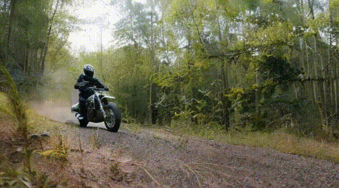

# diffusion-motion-transfer Cog model

This is an implementation of [diffusion-motion-transfer](https://github.com/diffusion-motion-transfer/diffusion-motion-transfer?tab=readme-ov-file) as a [Cog](https://github.com/replicate/cog) model.

## Development

Follow the [model pushing guide](https://replicate.com/docs/guides/push-a-model) to push your own model to [Replicate](https://replicate.com).

## Basic Usage

Clone the github repo

    git clone https://github.com/diffusion-motion-transfer/diffusion-motion-transfer.git motion/

Run a prediction

    cog predict -i video=@demo.mp4

## Example

